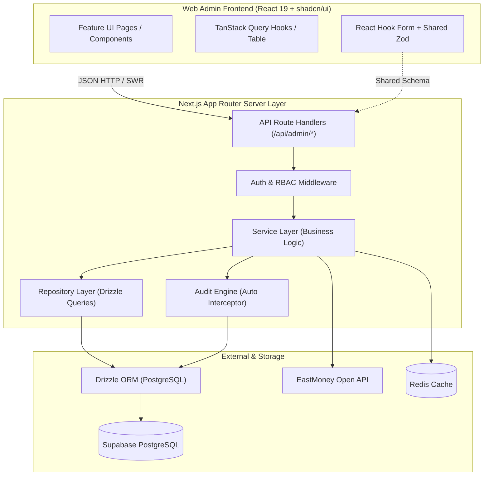

# 估值助手管理后台 V2 系统架构设计 (Architecture)

## 1. 架构演进与总体定位

Fund Assistant Admin V2 彻底摆脱 Vite SPA + 散乱 API Client 的传统模式，转变为基于 **Next.js 16+ (App Router) + React 19 + TypeScript + Drizzle ORM** 构建的全栈现代化控制台。

Supabase 在本架构中被明确定义为 **PostgreSQL 托管基础设施**，业务访问层严禁在客户端直接引入或调用 Supabase Client，而是由 Next.js 服务端通过 Drizzle ORM 统一进行事务控制、审计生成、数据校验与安全拦截。



---

## 2. 分层架构与职责划分

```text
src/
├── app/                          # Next.js App Router 路由、Layout 与全局 Provider
│   ├── (auth)/                   # 登录等免鉴权路由组
│   ├── (dashboard)/              # 鉴权后管理端主路由组
│   └── api/admin/                # 服务端 Route Handlers 接口入口
├── features/                     # 按业务能力垂直切分的前端特性模块
│   ├── dashboard/                # 工作台与指标卡
│   ├── users/                    # 用户、持仓、流水、关注
│   ├── feedback/                 # 反馈处理与流转
│   ├── hot-funds/                # 热门基金运营
│   ├── changelog/                # 版本发布日志
│   ├── resources/                # 交流与支持资源
│   ├── stock-pool/               # 东财股票池与标的管理
│   ├── layout-builder/           # 行情页面编排器
│   ├── settings/                 # 业务配置与提审开关
│   ├── health/                   # 独立健康巡检
│   └── audit/                    # 操作审计与结构化 Diff
├── components/                   # 跨业务通用组件与 shadcn/ui 原语
│   ├── ui/                       # shadcn/ui 原语 (Button, Dialog, Sheet, Table, etc.)
│   └── admin/                    # 管理端通用封装 (PageHeader, MetricCard, DataTable, etc.)
├── server/                       # 核心服务端层 (Node.js 运行时，安全隔离)
│   ├── auth/                     # 认证、Session 与 RBAC 策略
│   ├── services/                 # 业务规则、原子事务编排与持仓计算
│   ├── repositories/             # 纯粹的数据访问与 Drizzle 查询
│   ├── audit/                    # 统一审计日志拦截与快照生成器
│   └── integrations/             # 外部集成 (EastMoney 证券解析, Redis 缓存)
├── db/                           # 数据库 Schema、Drizzle 配置与迁移脚本
│   ├── schema/                   # 分表 Drizzle Schema (users, market, audit, etc.)
│   ├── index.ts                  # 统一导出的 db 实例
│   └── migrations/               # Drizzle Kit 生成的 SQL 迁移
├── lib/                          # 通用工具函数 (formatters, date, cn, env)
└── types/                        # 全局共享 TypeScript 类型定义
```

### 2.1 服务端与客户端边界 (Server / Client Boundary)
* **API Route Handlers (`src/app/api/admin/*`)**：
  * 只负责处理 HTTP 协议层：读取请求、提取 Cookie/Session、调用 Zod 校验入参、调用对应的 Service 方法、捕获异常并返回标准格式响应。
  * 严禁在 Route Handler 中直接书写复杂的 SQL 操作或业务流转。
* **业务服务层 (`src/server/services/*`)**：
  * 系统真正的“大脑”。封装所有关键业务逻辑（如：流水的增删改 + 持仓强制重算的数据库事务；股票删除前的全量引用排查；行情编排的原子化草稿保存与版本自增）。
  * 自动在事务中提交审计记录。
* **数据仓库层 (`src/server/repositories/*`)**：
  * 仅封装基于 Drizzle ORM 的增删改查。不对外暴露裸 SQL 拼接，保证类型安全。
* **集成层 (`src/server/integrations/*`)**：
  * 外部服务封装，例如 `eastmoney/client.ts` 负责调用东财联想搜索及标的元数据解析，内置重试、超时与网络容错。

---

## 3. 认证与权限架构 (Auth & RBAC)

### 3.1 认证机制
* 采用基于 HTTP-only Cookie 的持久化 Session / JWT 认证体系，避免将敏感 Token 裸露在 LocalStorage 中，彻底防御 XSS 窃取风险。
* 提供账号体系扩展：
  * 系统内置超级管理员初始化机制（环境变量驱动或首次启动 Seed）。
  * 账户表模型保留密码加盐哈希（`bcrypt` / `argon2`）、角色字段（`role: 'admin' | 'operator' | 'readonly'`）及权限列表。

### 3.2 RBAC 权限判定矩阵
```typescript
export type AdminRole = 'admin' | 'operator' | 'readonly';

export const RolePermissions = {
  admin: ['*'],
  operator: [
    'users:read', 'feedback:read', 'feedback:write',
    'content:read', 'content:write',
    'market:read', 'market:write',
    'audit:read', 'health:read'
  ],
  readonly: [
    'users:read', 'feedback:read', 'content:read',
    'market:read', 'settings:read', 'audit:read', 'health:read'
  ],
} as const;
```
* 服务端路由守卫与 Service 统一校验权限代码，拒绝无权限操作。
* 前端通过统一的 `usePermission()` Hook 自动隐藏或禁用相应操作按钮（例如 readonly 角色不显示流水编辑/删除/重算按钮）。

---

## 4. 数据流与状态管理模式

### 4.1 Server State (TanStack Query v5)
* 所有的远端数据请求一律通过 TanStack Query 管理。
* **Stale Time 细粒度策略**：
  * 高频变动数据（如 Health Check）：`staleTime: 30s`，支持每 60 秒轮询。
  * 列表数据（如 Users, Feedback, Audit）：`staleTime: 20s`。
  * 相对静态配置（如 Settings, Content, MarketConfig）：`staleTime: 60s`。
* **高风险 Mutation 约束**：
  * 对于持仓重算、流水删除、系统提审模式切换等高风险动作，**坚决不使用 Optimistic Update（乐观更新）**，必须等待服务端事务成功确认后，强制触发对应 Query Key 的 `invalidateQueries`，确保用户看到的永远是真实数据状态。

### 4.2 Local UI State
* 局部组件状态（如抽屉展开、表单编辑弹窗、搜索关键字缓冲输入）统一使用 React `useState` / `useReducer`。
* 分页、筛选和搜索条件全部同步至 **URL Search Params**，保证页面刷新、多标签页打开、分享 URL 时视图完全一致。

---

## 5. 审计与快照引擎 (Audit Engine)

为了确保全站数据操作可追溯，V2 架构实现统一的审计服务：
1. **统一上下文提取**：每次写操作通过中间件或 Service 上下文获取当前操作管理员（`adminId`, `email`）及客户端 IP。
2. **前后数据镜像自动生成**：
   * 在执行更新或删除前，Service 层先通过 Repository 查出 `before_data`。
   * 在事务内提交变更，生成 `after_data`。
   * 写入 `audit_logs` 表：记录 `action`、`target_type`、`target_id`、`before_data`、`after_data`、`reason`（必填）。
3. **前端结构化 Diff 渲染**：前端审计详情内置 `JsonDiff` 组件，自动比对两个 JSON 对象的键值差异，直观标注变更行。

---

## 6. 统一错误模型与响应协议 (Unified Error Model)

```typescript
// 标准 API 成功响应封套
export type ApiResponse<T> = {
  success: true;
  code: 0;
  message: string;
  data: T;
  timestamp: string;
};

// 标准 API 错误响应封套
export type ApiErrorResponse = {
  success: false;
  code: string;            // 业务错误码，如 'ERR_STOCK_REFERENCED'
  message: string;         // 面向用户的友好提示
  fieldErrors?: Record<string, string[]>; // 表单字段级校验错误
  details?: unknown;       // 补充上下文（如引用了该股票的模块列表）
  timestamp: string;
};
```
前端封装专用的 `handleApiError` 工具，精准将 `fieldErrors` 映射至 React Hook Form，并触发全局 Toast 提醒，彻底取缔根据文本内容 `message.includes(...)` 的脆弱判断。
