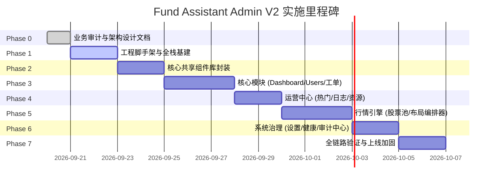

# 估值助手管理后台 V2 分阶段实施计划 (Implementation Plan)

本文档制定 Fund Assistant Admin 从现有 Vite + AntD 彻底重构为 Next.js 16+ + shadcn/ui + Drizzle ORM 的工程落地演进路线。

---

## 阶段规划概览

---

## 详细里程碑与检查清单 (Milestones & Checklists)

### Phase 0: 业务审计与技术规范 (已完成)
- [x] 完整审计现有代码库（数据类型、现有路由、API 调用、业务约束与隐蔽规则）。
- [x] 输出完整设计文档集（产品需求、系统审计、系统架构、信息架构、数据库设计、接口设计、设计系统、UI 规范、迁移方案、实施计划）。

### Phase 1: 全栈工程基建 (Foundation)
- [ ] **项目工程框架搭建**：
  - 初始化 Next.js 16+ (App Router) + React 19 + TypeScript。
  - 配置 Tailwind CSS v4 与 CSS Custom Properties 颜色 Token。
  - 集成 `next-themes` 支持深色/浅色模式切换。
  - 安装并配置 Lucide React 图标库与 shadcn/ui 底层原语。
- [ ] **数据与服务端基建**：
  - 配置 Drizzle ORM + Drizzle Kit，连接 Supabase PostgreSQL。
  - 编写并导出完整的 Drizzle Schemas（`src/db/schema/*`）。
  - 配置服务端数据库客户端连接池 (`src/server/db/index.ts`)。
- [ ] **认证与权限底层 (Auth Foundation)**：
  - 实现管理员 Cookie-based Session 认证机制与安全加密。
  - 实现管理员登录、当前态、登出的服务端 Route Handlers。
  - 实现基于角色的 RBAC 路由守卫中间件。
- [ ] **后台主骨架 (Admin Shell Layout)**：
  - 实现统一的响应式侧边栏（`Sidebar`）：支持展开/折叠、导航分组、激活态、移动端 Sheet 抽屉。
  - 实现轻量顶部栏（`Header`）：面包屑、主题切换器、管理员账户菜单与退出交互。
  - 封装全局 TanStack Query Provider 与统一异常拦截。

### Phase 2: 后台标准组件体系 (Shared Admin Components)
- [ ] 封装 `<PageHeader />`：规范化标题、描述与动作插槽。
- [ ] 封装 `<MetricCard />`：用于工作台标准指标呈现（带数值等宽排版、图标容器）。
- [ ] 封装 `<StatusBadge />`：带语义圆点的轮廓型状态标签。
- [ ] 封装 `<DataTable />` & `<DataTableToolbar />`：
  - 基于 TanStack Table v8 封装高密数据表格。
  - 统一实现分页、排序、空状态（EmptyState）、骨架屏（TableSkeleton）。
  - 支持多条件筛选与 URL Query 参数双向自动同步。
- [ ] 封装操作与安全交互弹窗：
  - `<DetailSheet />`：右侧大尺寸滑出抽屉基础封装。
  - `<ConfirmActionDialog />`：危险动作确认。
  - `<ReasonDialog />`：强制要求输入操作原因的模态对话框。
  - `<CopyButton />`：支持复制 OpenID、secid 等关键文本。
  - `<JsonDiffViewer />`：用于审计日志的高亮结构化对比器。

### Phase 3: 核心业务能力 (Dashboard, Users, Feedback)
- [ ] **工作台 (Dashboard)**：
  - 指标卡片网格渲染（总用户、今日新增、金额记录用户、关注用户、待处理反馈、热门基金数）。
  - 基础设施健康状态摘要（API、Supabase、Redis 状态徽标）。
  - 关键系统开关快照展示。
- [ ] **用户数据中心 (Users)**：
  - 用户主表：支持分页搜索（昵称、用户编号、openid 复合匹配）。
  - 用户画像大抽屉 (`UserDetailSheet`)：
    - **Tab 1 持仓记录 (Holdings)**：展示持仓金额、成本、份额，支持触发持仓全量重算。
    - **Tab 2 交易流水 (Transactions)**：展示买卖明细，支持编辑/删除流水（强制弹窗输入原因，并在服务端单个事务内连带完成流水变动 + 持仓汇总重算 + 写入审计日志）。
    - **Tab 3 关注清单 (Watchlist)**：查看用户自选标的。
    - **Tab 4 用户反馈 (User Feedback)**：展示该用户历史工单。
- [ ] **反馈处理中心 (Feedback)**：
  - 工单列表展示与状态、优先级过滤。
  - 处理对话框：流转状态（open -> processing -> resolved / ignored）、调整优先级、录入 500 字管理员备注，服务端自动写入审计日志。

### Phase 4: 运营内容管理 (Operations Center)
- [ ] **热门推荐 (Hot Funds)**：
  - 独立管理页面，支持增删改查、即时启用/停用与顺序微调。
- [ ] **版本日志 (Changelog)**：
  - 独立管理页面，结构化录入更新条目。
  - 服务端事务保障“同一时间全局最多只有 1 个最新版本”。
- [ ] **交流与支持资源 (Resources)**：
  - 独立管理页面，根据 `action_type`（预览图片、复制文本、页面跳转）动态渲染差异化表单。

### Phase 5: 行情系统与编排引擎 (Market Engine)
- [ ] **东方财富股票池 (Stock Pool)**：
  - 实时东财证券联想检索 API 与展示。
  - 服务端权威解析并持久化入库，杜绝前端手工录入。
  - 从东财重新拉取刷新标的信息。
  - 标的删除强引用校验（若仍被顶部指标或任一模块引用，严格拒绝并具体反馈引用处）。
- [ ] **行情页面编排器 (Layout Builder)**：
  - 顶部指标（Tickers）编辑与排序。
  - Tabs -> Sections -> Modules 三级可视化编排结构树。
  - 模块类型判定（DIRECT 单标的直读校验 1 只股票，AVERAGE 成分平均校验 ≥ 2 只股票）。
  - 草稿（Draft）本地缓存与未保存脏状态提示（Dirty State）。
  - 原子化发布（Publish）：服务端整体校验、版本递增、快照生成与审计留痕。

### Phase 6: 系统治理与审计中心 (System & Governance)
- [ ] **系统设置 (Settings)**：
  - 分组呈现：审核与合规、功能特性开关、资源图片链接、高级通用 K-V 配置。
  - 针对 `review_mode`（提审模式）高风险开关实现严格的 `AlertDialog` 防误触警告。
- [ ] **独立服务健康巡检 (System Health)**：
  - 深度探测 API 响应延迟、Supabase 读写、Redis 缓存服务。
- [ ] **操作审计日志 (Audit Logs)**：
  - 审计流水全量展现与筛选（动作、对象类型、时间跨度）。
  - 抽屉展示变更前与变更后 JSON 的结构化 Diff 对比。

### Phase 7: 全链路测试、数据迁移与上线加固
- [ ] **关键链路自动化与回归测试**：
  - 流水修改/删除事务与持仓重算一致性校验。
  - 股票池删除引用保护测试。
  - 行情编排版本发布快照原子性校验。
  - 提审模式防误触交互与状态生效测试。
- [ ] **部署与环境配置**：
  - 验证生产环境 Node.js 运行时与 Vercel / 独立容器构建。
  - 执行 Drizzle 初始管理员 Seed 注入。
  - 线上试运行与旧版后台无缝平移。
